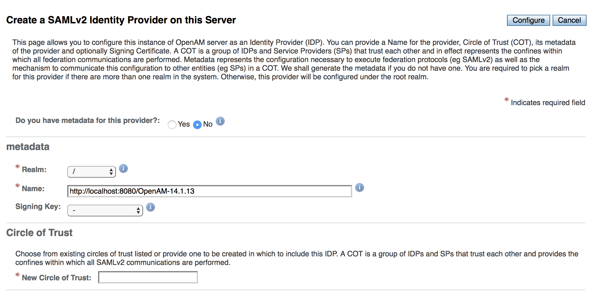

<!--
Copyright (c) 2018 Codice Foundation

Released under the GNU Lesser General Public License; see
http://www.gnu.org/licenses/lgpl.html
-->

# The [OpenAM](https://github.com/OpenIdentityPlatform/OpenAM) SAML Implementation
## Known Compliance Issues
| Issue| Section | Specification Snippet
| -----| ------- | ---------------------
|Does not respond with SAML error responses with a top-level status code but throws an exception instead | Core 3.4.1.4 | If the responder is unable to authenticate the presenter or does not recognize the requested subject, or if prevented from providing an assertion by policies in effect at the identity provider (for example the intended subject has prohibited the identity provider from providing assertions to the relying party), then it MUST return a `<Response>` with an error `<Status>`.
| Uses `post` instead of `POST` as the action attribute on POST SAML Responses | Bindings 3.5.4 | The action attribute of the form MUST be the recipient's HTTP endpoint for the protocol or profile using this binding to which the SAML message is to be delivered. The method attribute MUST be "POST". 
| Does not use errorless Base64 encryption | Bindings 3.5.4 | A SAML protocol message is form-encoded by applying the base-64 encoding rules to the XML representation of the message and placing the result in a hidden form control within a form as defined by [HTML401] Section 17.
| Does not validate that Relay States are less than or equal to 80 bytes| Bindings 3.4.3 | RelayState data MAY be included with a SAML protocol message transmitted with this binding. The value MUST NOT exceed 80 bytes.
| Does not validate the \<Subject\> element on the \<AuthnRequest\> | Profiles 4.1.4.1 | Note that the service provider MAY include a <Subject> element in the request that names the actual identity about which it wishes to receive an assertion. This element MUST NOT contain any <SubjectConfirmation> elements. If the identity provider does not recognize the principal as that identity, then it MUST respond with a <Response> message containing an error status and no assertions.
| Does not sign POST Logout Responses | Profiles 4.4.4.2 | The responder MUST authenticate itself to the requester and ensure message integrity, either by signing the message or using a binding-specific mechanism.
| Does not use the same NameID given from the AuthRequest in the Logout Request | Profiles 4.4.4.1 | The principal MUST be identified in the request using an identifier that strongly matches the identifier in the authentication assertion the requester issued or received regarding the session being terminated, per the matching rules defined in Section 3.3.4 of [SAMLCore].
| Does not respond with the SAML Request's relay state | Bindings 3.5.4 | If a "RelayState" value is to accompany the SAML protocol message, it MUST be placed in an additional hidden form control named RelayState within the same form with the SAML message.
| Does not return a SAML Error Response when given a Non-Matching destination | Core 3.2.1 | If [Destination] is present, the actual recipient MUST check that the URI reference identifies the location at which the message was received. If it does not, the request MUST be discarded.

## Steps to Test OpenAM's IdP
#### Installing OpenAM
* Download [Apache Tomcat](https://tomcat.apache.org/download-70.cgi).
* Download the OpenAM .war files from [OpenAM Releases](https://github.com/OpenIdentityPlatform/OpenAM/releases).
* Rename OpenAM-\<version\>.war to OpenAM.war.
* Unzip Apache Tomcat and move all OpenAm .war files into \<tomcat\>/webapps.
* Run the following commands to start tomcat:

##### NIX
```bash
chmod -R 755 <tomcat>/bin
export CATALINA_HOME="<tomcat>"
sh <tomcat>/bin/startup.sh
```
##### Windows
```
# Make sure your JAVA_HOME is set
<tomcat>/bin/startup.bat
```

#### Setup OpenAM as a hosted IdP

* Follow the steps [here](https://github.com/OpenIdentityPlatform/OpenAM/wiki/Quick-Start-Guide#basic-openam-setup) up to the Policy Configuration step.

* Once you've logged in as amAdmin, navigate to Create Hosted Identify Provider, (Top Level Realm :arrow_right: Configure SAMLv2 Provider :arrow_right: Create Hosted Identify Provider).

* Fill out the form (shown below) by picking a signing key, entering a name for the Circle of Trust (CoT) and clicking Configure.

  * **NOTE**: "http://localhost:8080/OpenAM-14.1.13" would be the **baseURL** and "/" would be the **realmName** in the above example.

#### Registering and Configuring the SamlCTK
* Register a new Service Provider under the same Circle of Trust (CoT) and give it the following metadata: [`samlconf-sp-metadata.xml`](../../../deployment/distribution/src/main/resources/samlconf-sp-metadata.xml)

* Navigate to the SAML2 page on OpenAM, (Realm :arrow_right: Applications :arrow_right: SAML 2.0).
* Click on the CoT that was just made containing the OpenAM IdP.
* Ensure that both `https://samlhost:8993` and `https://samlhostdsa:8994` are added to the CoT.

* Setup a new user for the SamlCTK to connect as, (Realm :arrow_right: Subjects :arrow_right: New...).
  * ID: `admin`
  * Password: `changeIt`

* Add the OpenAM IdP metadata to the SamlCTK
  * Add the IdP metadata to the SamlCTK by going to `<baseUrl>/saml2/jsp/exportmetadata.jsp?realm=<realmName>`
  * Copy that XML into the [openam-idp-metadata.xml](src/main/resources/openam-idp-metadata.xml) file found under `deployment/distribution/build/install/samlconf/implementations/openam/`, replacing the pre-existing contents.

* Configure the SamlCTK to your OpenAM setup by filling out and modifying the following XML: [OpenAMLoginData.xml](src/main/resources/OpenAMLoginData.xml) found under `deployment/distribution/build/install/samlconf/implementations/openam/`.

* You're all set, run the `samlconf` script under `deployment/distribution/build/install/samlconf/bin` with `-i ../implementations/openam -l -u admin:changeIt`.